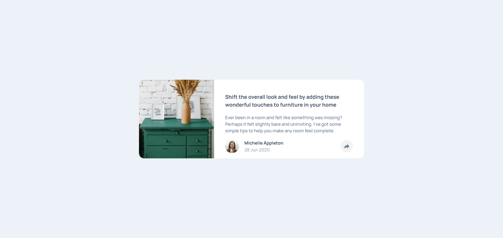
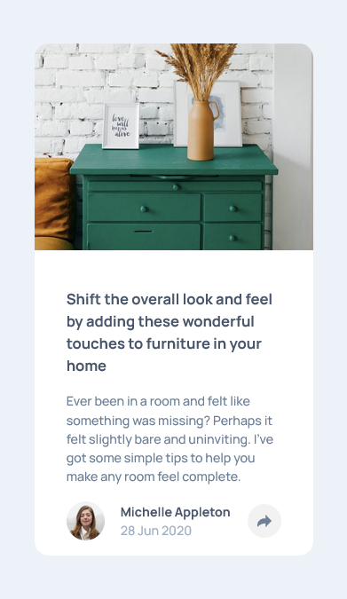

# Frontend Mentor - Article preview component solution

This is a solution to the [Article preview component challenge on Frontend Mentor](https://www.frontendmentor.io/challenges/article-preview-component-dYBN_pYFT). Frontend Mentor challenges help you improve your coding skills by building realistic projects.

## Table of contents

- [Overview](#overview)
  - [The challenge](#the-challenge)
  - [Screenshot](#screenshot)
  - [Links](#links)
- [My process](#my-process)
  - [Built with](#built-with)
  - [What I learned](#what-i-learned)
  - [Continued development](#continued-development)
  - [Useful resources](#useful-resources)
- [Author](#author)

## Overview

### The challenge

Users should be able to:

- View the optimal layout for the component depending on their device's screen size📱💻
- See the social media share links when they click the share icon

### Screenshot

### Links

- Github Repo: [🍴 Fork me](https://github.com/basitkorai/article-preview-component)
- Live Site: [🏡I'm Live Here](https://article-preview-korai.netlify.app)

## My process

### Built with

- Semantic HTML5 markup
- Flexbox
- CSS Grid
- Mobile-first workflow
- [SASS/SCSS](https://sass-lang.com) - CSS with superpower
- Vanilla Javascript

### What I learned

- Just refreshed my `position` property and other `CSS` knowledge.

### Continued development
- I will circle back to this challenge to enhance it by fixing the alignment of the popup and add animations to it.

### Useful resources

- [A blog on position](https://blog.webdevsimplified.com/2022-01/css-position/) - It helped me with the position propery

## Author

- Website - Don't have it yet
- Frontend Mentor - [@basit-flash](https://www.frontendmentor.io/profile/basit-flash)
- Twitter - [@basitkorai](https://www.twitter.com/basitkorai)

